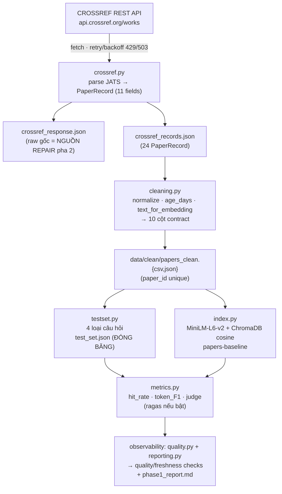
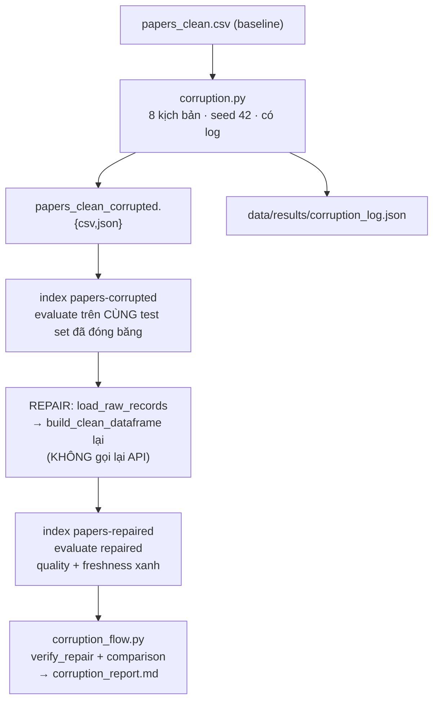
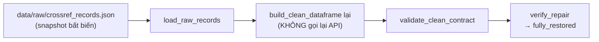

# Giải thích Pipeline — 2 câu hỏi demo (Day 10: Data Pipeline & Data Observability)

> Tài liệu trả lời 2 câu hỏi dùng để trình bày, đối chiếu với artifact thật trong repo.
> Xem thêm bản đầy đủ: [`DATA_PIPELINE_DESIGN.md`](./DATA_PIPELINE_DESIGN.md)

---

## CAU 1 — Data pipeline thiết kế như thế nào?

### 1.1 Kiến trúc tổng quan (2 pha)



**Pha 2 — Corruption / Repair / Comparison:**



### 1.2 Data contract (chốt ở checkpoint C1)

| Clean schema — 10 cột (owner: TV2 `cleaning.py`) | Ràng buộc |
| --- | --- |
| `paper_id, title, summary, published, authors_joined, categories_joined, age_days, text_for_embedding, abs_url, pdf_url` | `paper_id` không null/không trùng; `text_for_embedding` không rỗng |

| Test set — 5 field mỗi item (owner: TV2 `testset.py`) | Ràng buộc |
| --- | --- |
| `id, question_type, question, ground_truth, ground_truth_doc_ids` | `ground_truth_doc_ids` không được rỗng (rỗng thì hit_rate = 0) |

> `phase1.py` validate **fail-fast kèm tên owner** — ai làm sai schema là biết ngay.

### 1.3 Con số thực tế từ artifact

| Thành phần | Giá trị |
| --- | --- |
| Source | Crossref REST API (`api.crossref.org/works`) |
| Query/filter | `agentic retrieval augmented generation large language model` + `from-pub-date:180d, has-abstract:true` (`max_results=24`) |
| Raw records | 24 |
| Clean records | 24 (10 cột, `paper_id` unique) |
| Test set | 16 câu hỏi, đóng băng → summary 4, authors 4, date 4, categories 4 |
| Embedding | `sentence-transformers/all-MiniLM-L6-v2` (normalized) |
| Vector store | ChromaDB cosine, `top_k = 4` |
| Collections | `papers-baseline` / `papers-corrupted` / `papers-repaired` (riêng, không đè baseline) |
| Freshness | ngưỡng 180 ngày (baseline: 0/24 quá hạn) |

**3 nguyên tắc sống còn:** test set đóng băng 1 lần · 3 trạng thái dùng path/collection riêng · repair = chạy lại cleaning từ raw (không sửa tay kết quả).

---

## CAU 2 — Nhóm làm dữ liệu xấu đi và xử lý lại như thế nào?

### 2.1 Làm dữ liệu xấu đi (Corruption) — 8 kịch bản có kiểm soát

- **Seed cố định:** `42` (tái lập được)
- **Kết quả:** 24 → 23 dòng, **20/24** tài liệu bị đụng đến

| # | Loại lỗi | Số dòng | Mô tả |
| --- | --- | --- | --- |
| 1 | `drop_latest_records` | 3 | Xóa các record mới nhất khỏi corpus |
| 2 | `blank_summary` | 3 | Xóa trắng summary — agent mất nội dung trả lời |
| 3 | `inject_noise` | 3 | Chèn text rác vào summary — làm nhiễu embedding |
| 4 | `truncate_title` | 3 | Cắt title còn 12 ký tự — hỏng exact lookup |
| 5 | `stale_published_date` | 3 | Đẩy published lùi 400 ngày **+ tính lại age_days** |
| 6 | `swap_authors` | 3 | Gán nhầm authors sang paper khác — lỗi join sai khóa |
| 7 | `rebuild_text_for_embedding` | 12 | Dựng lại text cho mọi dòng đã đổi cột nguồn |
| 8 | `duplicate_rows` | 2 | Nhân bản dòng — phá ràng buộc `paper_id` unique |

**2 ràng buộc bắt buộc** (bỏ qua thì corruption vô nghĩa):
- Sửa `published` → **phải tính lại `age_days`** (freshness check đọc `age_days`)
- Sửa cột nguồn → **phải dựng lại `text_for_embedding`** (ChromaDB nhúng cột này)

### 2.2 Observability báo động — phát hiện TRƯỚC khi người dùng hỏi

| Check | Baseline | Corrupted |
| --- | --- | --- |
| `row_count` | ✅ PASS | ✅ PASS (23 rows) |
| `required_columns_present` | ✅ PASS | ✅ PASS |
| `paper_id_not_null` | ✅ PASS | ✅ PASS |
| `paper_id_unique` | ✅ PASS | ❌ **FAIL** (2 duplicate) |
| `title_not_null` | ✅ PASS | ✅ PASS |
| `summary_length` | ✅ PASS | ❌ **FAIL** (3 dòng < 40 ký tự) |
| `freshness` | ✅ PASS | ❌ **FAIL** (3/23 dòng > 180 ngày) |

Freshness corrupted: **STALE** — 3/23 dòng quá hạn (cũ nhất: 2025-01-29).

### 2.3 Thiệt hại đo được — agent bắt đầu trả lời sai

| Metric | Baseline | Corrupted | Thay đổi |
| --- | ---: | ---: | ---: |
| `retrieval_hit_rate` | 1.0000 | 0.7500 | **−0.2500** |
| `mean_token_f1` | 1.0000 | 0.5900 | **−0.4100** |
| `judge_accuracy` | 1.0000 | 0.6250 | **−0.3750** |
| `mean_judge_score` | 5.0000 | 3.6875 | **−1.3125** |

> Dữ liệu xấu làm agent **retrieve sai 4/16 câu** và token F1 rơi 0.41.

### 2.4 Xử lý lại (Repair) — dựng lại từ raw snapshot, có kiểm chứng



**Kết quả phục hồi:**

| Metric | Baseline | Corrupted | Repaired | Phục hồi |
| --- | ---: | ---: | ---: | ---: |
| `retrieval_hit_rate` | 1.0000 | 0.7500 | **1.0000** | ✅ 100% |
| `mean_token_f1` | 1.0000 | 0.5900 | **1.0000** | ✅ 100% |
| `judge_accuracy` | 1.0000 | 0.6250 | **1.0000** | ✅ 100% |
| `mean_judge_score` | 5.0000 | 3.6875 | **5.0000** | ✅ 100% |

**Kiểm chứng repair bằng dữ liệu (`verify_repair`):**

```json
{
  "baseline_rows": 24,
  "repaired_rows": 24,
  "missing_after_repair": [],
  "unexpected_after_repair": [],
  "fully_restored": true
}
```

> Repair thành công tuyệt đối vì **raw snapshot được lưu nguyên vẹn từ pha 1** — nguồn gốc không hề bị corrupt.

---

## Tóm tắt 2 câu hỏi

1. **Pipeline** = Crossref → raw → clean (10 cột) → test set (đóng băng) → index (MiniLM + ChromaDB) → evaluate → quality/freshness → report; rồi corruption → evaluate → repair từ raw → compare.
2. **Làm xấu** = 8 kịch bản có seed và log (drop/blank/noise/truncate/stale/swap/duplicate + rebuild text). **Xử lý lại** = dựng LẠI từ raw, `verify_repair` khớp baseline, agent metric phục hồi 100%.

> Cả 3 trạng thái đều chấm trên **cùng 1 bộ đề đóng băng**, cùng 1 model judge.

---

## Artifact đối chiếu

| Nội dung | Đường dẫn |
| --- | --- |
| Corruption log | `data/results/corruption_log.json` |
| Tổng hợp so sánh | `data/quality/corruption_summary.json` |
| Báo cáo so sánh | `data/reports/corruption_report.md` |
| Metrics 3 trạng thái | `data/results/{baseline,corrupted,repaired}_metrics.json` |
| Báo cáo baseline | `data/reports/phase1_report.md` |
